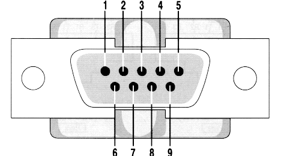

# Archived
Whilst the contents of this repository might still be useful for decades to come, it is unlikely to require any further changes. Therefore, it was archived on the 5th of June 2025.

## G923 Pedals USB Adaptor
Below, you can find all the instructions you need to make your own USB adaptor for Logitech Pedals. It was tested with the G923 Pedals, but it should work with previous generations too (G920, G29, G27, etc.) as long as they use a DB9 connector.

## Bill of materials
**Arduino Nano Board**  
You will need an arduino board of your own choosing. The Arduino NANO would be a perfect choice given their size and price.

**DB9 Connector**  
The G923 pedals have a DB9 Connector (male) on their end. Avoiding an intrusive mod will require a DB9 (female) connector.

**Cables**  
You will need one Micro USB to USB A cable, can even be USB 2 as there isn't a lot of data going through.

**Tools**  
You will need a soldering gun, some cables to run the connections, solder, flux and some insulating tape, preferably some shrink wrap too.

## Assembly
First, you'll have to solder the bits and bobs together. You will need to make 6 connections from the DB9 plug to the Arduino board according to the table below:

| Plug Pin | Arduino Pin | Function |
|----------|-------------|----------|
| Pin 1    | Ground      | GND      |
| Pin 2    | A2          | Throttle |
| Pin 3    | A1          | Break    |
| Pin 4    | A0          | Clutch   |
| Pin 6    | 5V          | VCC      |
| Pin 9    | 5V          | VCC      |

The image below shows you which pin is which. Keep in mind this is taken from behind (the side the soldering takes place on).

## Code
You will need to download Arduino IDE or create an Arduino Create account. Once you've done that, you'll need to import this [Arduino Joystick Library](https://github.com/MHeironimus/ArduinoJoystickLibrary).
Finally, load the [g923_pedals.ino](./g923_pedals.ino) file into your editor.
Verify & Save then upload the script to your Arduino of choice.

## Calibration
Once you connect your device, you should be able to see it as a joystick in the Gamepad Setup in Windows.
Click on "Properties" then calibrate the axis shown.

| Axis     | Function |
|----------|----------|
| Z Axis   | Clutch   |
| Throttle | Throttle |
| Brake    | Brake    |

## Use

After calibration, your games should recognize the controller.

As the pedals are now their own independent device, you will need to configure the pedals by yourself in the game's settings.
